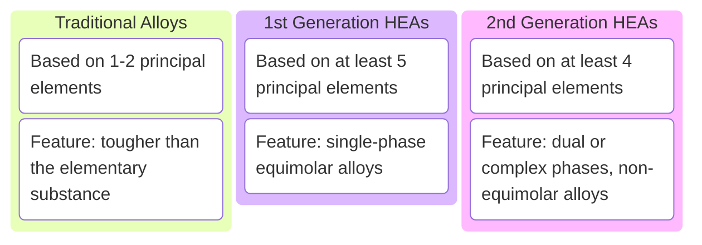

## 1. 历史

Yeh 设计提出了 $Cu Co Ni Cr Al_x Fe$ 型的 HEA（非等原子比）(2004)。Cantor 提出了 $Co Cr Fe Mn Ni$ 等原子比“多组合元合金” MCPAs：此结构 ① 元素分布均匀；② 单相 FCC

Yeh 对于 $Cu Co Ni Cr Al Fe Ti V$ 的研究，发现在常规铸造条件下可以形成 FCC 和 BCC 双相结构。而使用 “快速悬淬极速冷却” 方法可以得到 BCC 单相 纳米晶结构，发现 “五元 BCC FCC 结构” 的 HEA 晶体结构模型。并且在 `相图的中间区域` 可以得到具有**优异性能合金**的成分

 <b>图1.1</b>  1/2代高熵合金的发展 

一代等原子比高熵合金，二代非等原子比高熵合金。二代的提出为开发更多具有优异性能的高熵合金成分提供了更多成分设计空间，同时也提升了新型合金开发的难度。

Yan 统计了高熵合金概念的发展规律，定义的HEAs构型熵需求从 1.61R 降到了 1R，拓展熵值，同时也压缩了 MEAs 的定义空间。LEAs 相对变化不大，与 MEAs 的分界定义为 0.69R

 <b>图1.2</b>  高熵合金熵值划分阈值与时间的关系

高熵材料 **HEMs**：把高熵合金的构筑设计理念用于材料设计。拓展到陶瓷材料、有机物等。（ceramics, intermetallic, polymers, films, and alloys）

## 2. 影响 HEAs 性能的因素

1. 有序相的存在
2. 制备加工工艺：不同工艺通过影响 **有序相** 的形成 来影响合金性能

## 3. HEAs 的成型工艺

1. Gas-Solid 成型：（磁控溅射）

   低温、便捷、高效、样品易得。
   
   适用于熔点差异较大的合金体系。而后通过`高通量技术`筛选出优异性能的合金组分。磁控溅射对于 HEAs 体系成分与相的形成规律和性能的关系。
   
2. Liquid-Solid 成型：（铸造）

   广泛用于熔炼制备。添加高化学活性元素，从而形成有序相的低密度体系。铸造条件下的多体系低密度有序相的形成对于性能的影响。
  
3. Solid-Solid 成型塑性变形 + 后续热处理：

   用于有良好塑性变形能力的合金的综合性能优化。研究塑性变形与热处理对于有序相的形成与性能演变规律。

## 4. HEAs 的定义

与传统合金相应：传统合金由单一 “主元” 构成，如钢铁、铝合金、铜合金、镍合金等。对应于相图中也就相当于其边角区域。

“熵”，也即 Entropy，来自 Clausius，描述热力学第二定律中的热量与温度之间的关系
$$dS \leq \frac{dQ}{dT}$$
后来被 Boltzmann 改进，从热力学概率 $\Omega$ 的角度重新定义为：
$$ S=k_B\ln\Omega $$
对于一个含有 $n$ 种微观状态的气体系统，上式则转变为（气体常数 $R=8.314\,J/K$）
$$ S = -R \sum_i^n c_i \ln c_i $$
高熵合金的熵实际上是一种 `合金熔体构型熵`，也即 `Configurational Entropy`，$\Delta S_{conf}$。类比 Boltzmann 的熵公式，有构型熵
$$\Delta S_{conf} = R\ln n$$
其中，$n$ 为多组元合金添加元素种类数。

当 $n = 5$ 时，构型熵达到 1.61 R，远超传统合金体系的构型熵值。Yeh 认为高熵合金的组元数应当 ≥5 种，各组分应在 5%~35% 之间，从而确保所制备的合金具有较高的构型熵。**借助高构型熵的作用来抑制体系中有序金属间化合物的析出，促进固溶体的形成。**

高熵合金的概念也在不断更新。早期只有等原子比的，比如 AlCoCrCuFeNi、AlCoCrFeNiCuTiV、CoCrCuFeNi、AlCoCrFeNi、NbMoTaW、NbMoTaWV、TiZrHfNbTa、TiZrNbMoV、NbTiAlTaV等。逐步发展到非等原子比的，比如 $Al_xCoCrFeNi$、$Fe_{50}Mn_{30}Co_{10}Cr_{10}$、$AlCoCrFeNi_{2.1}$、$CoCrFeNi(Al/Ti)_x$ 等合金成分。

## 5. HEAs 的特点

高熵合金具有四大效应：

- **高熵效应**：

  较高的混合熵

- **晶格畸变效应**：

  添加元素的特性差异导致极大的晶格畸变

- **迟滞扩散效应**：
  
  高混合熵导致合金形成较为稳定的固溶体结构，增大原子过程中的迁移阻力，扩散难度大
  
- **鸡尾酒效应**：
  
  不同原子与浓度的组合特性，类似鸡尾酒可以进行性能调控

在理想熔体模型中，体系吉布斯自由能 $\Delta G_{mix}$ 有：（$\Delta H_{mix}$ 混合焓，$T$ 绝对温度）
$$\Delta G_{mix} = \Delta H_{mix} - T\Delta S_{mix}$$
所以在合金熔体形成时，混合熵和混合焓会相互竞争。高混合熵会导致整体吉布斯自由能降低，高温情况下作用更为明显。这将会降低合金原子有序化的趋势，进而抑制有序金属间化合物、复杂相的产生，促进多组元无序固溶体相的形成。

性能上，高熵使得高熵合金具有**高温稳定性**以及**抗高温软化**的能力。

结构上，一般认为高熵合金固溶体中，各个原子在各自晶体点阵上的位置是随机的。原子尺寸差异导致高熵固溶体存在严重的晶格畸变，进而形成强的固溶强化效果，提升合金性能。

高熵固溶体不能区分相对于传统合金中的溶剂和溶质，因此其存在形成原子级别应力的可能性，对材料的热、力、光、电学性质都会产生显著影响。

从动力学角度看，高熵合金由于其原子差异导致其协同调控能力变弱，从而抑制新相的形成。传统合金在溶质和溶剂原子填补空位后，形成的键结情形与填补之前相同；而高熵合金的扩散依靠空缺机制，鉴于各原子熔点和键结强度差异，高活度的原子更容易扩散到空位。但由于迟滞扩散效应存在，这种扩散并不容易发生。高熵合金组分复杂，各个元素之间的相互作用差异很大，复合效应协同配合也能造成其性能的差异与多样化。

**特点1：易于突破传统材料的强韧性极限**

诱导相变、多组元复合纳米强化、BCC 引入有序 O 复合体、BCC 稳定单相面引入可控梯度纳米缩放位错-细胞结构、鲱鱼鱼骨状共晶

**特点2：热稳定性高**

**特点3：抗辐照**

**特点4：优异的低温性能**

## 6. 设计方法

熵调控。

### 6.1 设计准则

Yeh：元素种类多，添加元素浓度高。

#### 6.1.1 $\Delta H_{mix}\sim\delta$ 判据

$\Delta H_{mix}\sim\delta$ 多组元合金相形成规律判据：
$$\Delta H_{mix} = \sum_{i=1,i\neq j}^n 4c_ic_j\,\Delta H_{mix}^{AB}$$
$$\delta = \sqrt{\sum_{i=1}^n c_i \left( 1-\frac{r_i}{\sum_{i=1}^n c_ir_i} \right)^2}$$
其中，$\delta$ 为原子尺寸差；$c_i$ 和 $c_j$ 分别为第 $i$ 和第 $j$ 个元素的摩尔百分比，$\mathrm{at.\%}$；$\Delta H_{mix}^{AB}$ 为两种元素的二元混合焓，$\mathrm{kJ/mol}$；$r_i$ 则为第 $i$ 个添加元素的原子半径。

通过计算合金的混合焓和原子半径差，结合已发表合金成分的 $\Delta H_{mix}\sim\delta$ 可以发现

1. 合金的 $\Delta H_{mix}$ 在 $\mathrm{-15\,kJ\cdot mol^{-1}} \sim \mathrm{5\,kJ\cdot mol^{-1}}$ 之间，$\delta\leq 5\%$ 的多组元合金能够形成随机固溶体结构；
2.  $\Delta H_{mix}$ 在 $\mathrm{-20\,kJ\cdot mol^{-1}} \sim \mathrm{0\,kJ\cdot mol^{-1}}$ 之间，$5\%\leq\delta\leq6.6\%$ 合金成分处于有序相和固溶体相的过渡区域。

<b>图6.1</b>  多组元合金混合焓~δ关系图

#### 6.1.2 $\Omega$ 判据

Yang.
$$\Omega = T_m\Delta S_{mix}/\Delta H_{mix}$$
$$T_m = \sum_{i=1}^n c_iT_i$$
$T_m$ 为计算的合金理论熔点；$T_i$ 为合金中第 $i$ 和合金添加元素的熔点。以此定义的稳定性经验判据为：$\Omega\geq1.1$ 和 $\delta\leq6.6\%$.

Xing. 通过引入“过冷”概念修订 $\Omega$ 判据，可以用于设计 HE Films。

#### 6.1.3 $VEC\sim\Delta\chi$ 判据

Guo. 利用价电子浓度（Valence Electron Concentration, VEC）和元素电负性差（Electronegativity Difference, $\Delta\chi$），给出 HEAs 形成 FCC 及 BCC 结构的判据。
$$VEC = \sum_{i=1}^n c_i(VEC)_i$$
$$\Delta\chi = \sqrt{\sum_{i=1}^n c_i \left(1-\frac{\chi_i}{\sum_{i=1}^n c_i\chi_i}\right)^2}$$
其中 $(VEC)_i$ 为第 $i$ 个添加元素的 $VEC$ 值；$\chi_i$ 为第 $i$ 个添加元素的 Pauling $\chi$ 值（鲍林标度）。当 $VEC < 6.87$ 时，更容易形成 BCC 结构；当 $6.87 \leq VEC \leq 8.0$ 时，两相共存。对于 $\Delta\chi < 6\%$，合金中更容易形成固熔体相。$VEC\sim\Delta\chi$ 判据是预测和区分 HEAs 晶格结构是否为 FCC / BCC 结构的重要指导原则。

---
[1] 李亚耸. 气/液/固成型对高熵合金中有序相形成及性能的影响[D/OL]. 2022[2026-06-11]. [https://link.cnki.net/doi/10.26945/d.cnki.gbjku.2022.000298](https://link.cnki.net/doi/10.26945/d.cnki.gbjku.2022.000298). DOI:[10.26945/d.cnki.gbjku.2022.000298](https://doi.org/10.26945/d.cnki.gbjku.2022.000298).